# Azure Cross-Forest Active Directory Consolidation and Hybrid Entra ID Lab

Loom link: https://www.loom.com/share/0c0c780611614999a79d6e7770d9aa4c


This project models an enterprise-pattern acquisition and directory-consolidation scenario in Microsoft Azure. I built separate source and target Active Directory forests, established the network and trust dependencies between them, migrated a controlled pilot with ADMT and Password Export Server, transitioned access with an AGDLP-style model, and synchronized the migrated users from the target forest to Microsoft Entra ID.

The lab also includes infrastructure as code, monitoring, governance, cost controls, change documentation, troubleshooting records, and SHA-256 evidence validation. It is a portfolio lab, not a production migration.

## Project highlights

- Deployed a three-server Azure environment with Terraform.
- Worked within a **four-vCPU regional quota**.
- Kept both domain controllers private; only the management server had a restricted public entry point.
- Configured conditional DNS forwarding and a two-way forest trust.
- Migrated two global groups and three pilot users with ADMT/PES.
- Resolved a real naming conflict without merging unrelated identities.
- Validated password continuity, group membership, resource authorization, and target-domain GPO.
- Configured Microsoft Entra Connect with Password Hash Synchronization and Pilot-OU filtering.
- Validated `mS-DS-ConsistencyGuid` source anchors and a real cloud sign-in.
- Tested Azure Monitor alert activation, email notification, and automatic resolution.
- Applied an audit-only Azure Policy control and reviewed expected noncompliance.
- Created a monthly Azure budget and reviewed the lab's actual cost.
- Consolidated and hashed 103 evidence files with zero missing hashes.

## Architecture

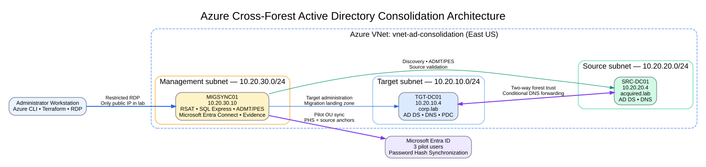

### Environment summary

| Component | Address / size | Purpose |
|---|---|---|
| `TGT-DC01` | `10.20.10.4` / `Standard_F1ams_v7` | Target `corp.lab` domain controller, DNS, PDC, and migration landing zone |
| `SRC-DC01` | `10.20.20.4` / `Standard_F1ams_v7` | Source `acquired.lab` domain controller and DNS |
| `MIGSYNC01` | `10.20.30.10` / `Standard_F2ams_v7` | RSAT, SQL Express, ADMT/PES, Microsoft Entra Connect, management, and evidence |
| Azure region | East US | Single-region home-lab deployment |
| Resource group | `rg-ad-consolidation` | Project boundary |
| Terraform resources | 20 | Final managed-resource count |
| Pilot OU | `OU=Pilot,OU=Users,OU=Corp,DC=corp,DC=lab` | Migration and cloud-sync boundary |

### Network and security pattern

- `TGT-DC01` and `SRC-DC01` have no public IP addresses.
- Administrative RDP to the domain controllers occurs through `MIGSYNC01`.
- The `MIGSYNC01` public RDP rule was restricted to the operator's `/32`.
- DNS conditional forwarders provide cross-forest name resolution.
- A two-way forest trust supports the controlled migration and access tests.
- Trusted Launch, Secure Boot, virtual TPM, and NVMe-compatible VM settings were validated.

## Business scenario

The lab represents an organization acquiring another company and consolidating selected identities from `acquired.lab` into `corp.lab`.

The pilot had to satisfy these controls:

1. Discover identities before migration.
2. Detect and resolve naming conflicts.
3. Migrate approved groups before users.
4. Preserve password continuity.
5. Validate access using target-domain authorization.
6. Synchronize only migrated pilot users to Microsoft Entra ID.
7. Prove the result with evidence instead of relying only on portal views.
8. Monitor, govern, document, and cost-review the completed environment.

## Migration and hybrid identity flow

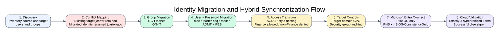

### Pilot scope

**Groups**

- `GG-Finance`
- `GG-IT`

**Users**

- `dlee`
- `jcarter-acq`
- `mallen`

A preexisting target account named `jcarter` belonged to a different identity. I retained the target account and renamed the migrated identity to `jcarter-acq`. I did not merge unrelated accounts simply because their names matched.

## Implementation phases

### 1. Infrastructure as code

Terraform created the Azure networking, subnets, network security groups, interfaces, public IP, managed disks, virtual machines, and shutdown schedules.

Key foundation checks included:

- Azure provider registration
- East US quota validation
- VM SKU availability
- Generation 2 Windows Server image compatibility
- NVMe disk-controller support
- Trusted Launch configuration
- Final drift check

The final Terraform plan reported no differences between configuration, state, and Azure.

### 2. Active Directory foundation

I created:

- Target forest: `corp.lab`
- Source forest: `acquired.lab`
- Conditional DNS forwarding in both directions
- Two-way forest trust
- Target OU hierarchy and dedicated Pilot OU
- Target resource groups for AGDLP-style access
- Source workforce users and departmental groups

`MIGSYNC01` was joined to `corp.lab`, configured to use `TGT-DC01` for DNS, and validated with a healthy secure channel.

### 3. ADMT/PES migration and access transition

The migration server used SQL Express and ADMT. Password Export Server supported pilot password continuity.

Validation included:

- Two global groups migrated with zero errors.
- Three approved users migrated.
- Temporary password-file residue count: zero.
- Source and target identity snapshots reviewed.
- AGDLP-style nesting validated.
- Finance access allowed as expected.
- Non-Finance access denied as expected.
- Target-domain Group Policy applied.

### 4. Microsoft Entra Connect

Microsoft Entra Connect was installed on `MIGSYNC01` with:

- Custom installation
- Password Hash Synchronization
- Target forest only
- Pilot OU only
- Two connectors
- Staging mode disabled
- Scheduler disabled during controlled initial synchronization
- Password writeback and other out-of-scope writeback features disabled

The initial sync was reviewed in stages:

1. Import target Active Directory.
2. Perform full synchronization.
3. Review exactly three pending cloud additions.
4. Export the three pilot users.
5. Import the cloud objects.
6. Stage and review three `mS-DS-ConsistencyGuid` updates.
7. Export the source-anchor updates to Active Directory.
8. Confirm the written anchors.
9. Validate no unexpected pending exports.
10. Enable the scheduler and observe a successful automatic Delta cycle.

The final cloud scope contained exactly the three approved pilot users.

### 5. Operations, governance, and evidence

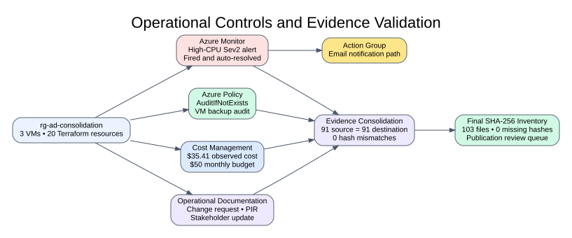

#### Azure Monitor

A controlled CPU-load test on `MIGSYNC01` validated:

- Alert fired
- Action group triggered
- Email delivered
- CPU returned below threshold
- Alert automatically resolved
- Resolution notification delivered

#### Azure Policy

The built-in VM-backup policy used `AuditIfNotExists` at resource-group scope.

Expected result:

- Three VMs evaluated
- Three VMs noncompliant
- No backup enabled by the validation
- No resources modified by the validation

The noncompliance result was useful evidence because backup was intentionally excluded from this short-lived lab.

#### Cost Management

Observed July 2026 lab cost:

| Category | Cost |
|---|---:|
| Total | **$35.41** |
| Virtual machines | $30.23 |
| Storage | $4.65 |
| Virtual network | $0.52 |
| Bandwidth | Less than $0.01 |

A `$50` monthly budget was configured with actual-cost thresholds at 50%, 75%, 90%, and 100%.

#### Evidence integrity

- `91` server evidence files copied locally
- `91` destination files confirmed
- `0` missing files
- `0` hash mismatches
- `103` total final evidence files inventoried
- `0` missing SHA-256 hashes
- `1` intentional duplicate-hash group: source and destination manifests
- Publication-review queue generated
- No original evidence deleted

## Validated outcomes

| Control | Result |
|---|---|
| Terraform configuration | Passed |
| Azure resource drift check | Passed |
| Source and target AD DS | Passed |
| Conditional DNS forwarding | Passed |
| Two-way forest trust | Passed |
| Migration discovery and conflict map | Passed |
| Group migration | Passed |
| User and password migration | Passed |
| AGDLP-style authorization | Passed |
| Target-domain GPO | Passed |
| Pilot-only Microsoft Entra sync | Passed |
| Password Hash Synchronization | Passed |
| Real cloud authentication | Passed |
| Scheduler-driven Delta cycle | Passed |
| Azure Monitor alert lifecycle | Passed |
| Azure Policy audit validation | Passed |
| Cost review and budget | Passed |
| Final evidence inventory | Passed |

## Selected evidence

### Azure foundation and Terraform

<table>
<tr>
<td width="50%">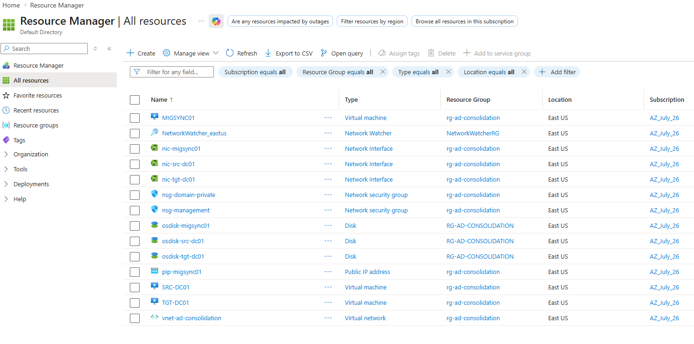<br><b>Azure resource inventory</b></td>
<td width="50%">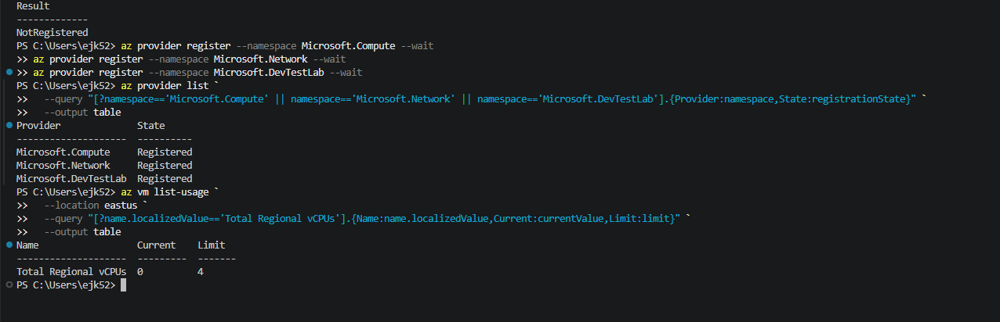<br><b>Four-vCPU quota validation</b></td>
</tr>
<tr>
<td width="50%">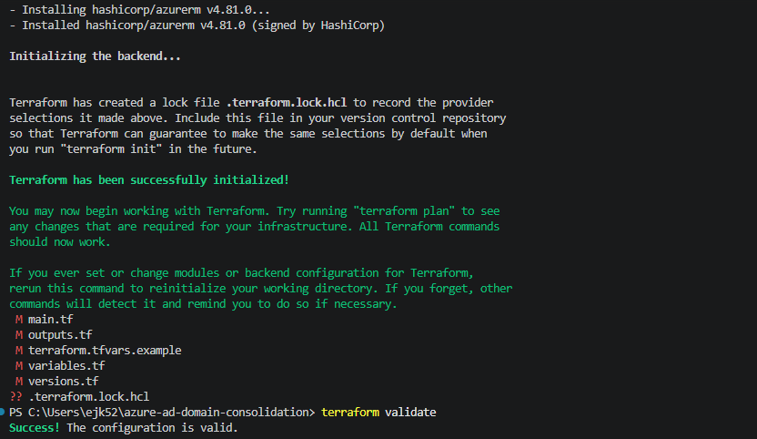<br><b>Terraform initialized and validated</b></td>
<td width="50%">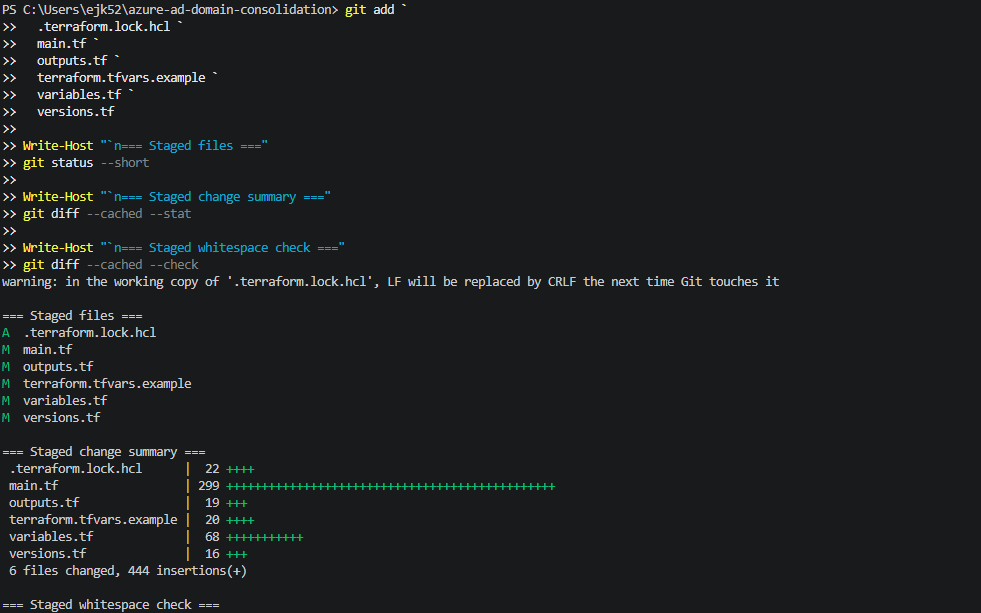<br><b>Explicit Git staging and review</b></td>
</tr>
</table>

### Directory foundation and trust

<table>
<tr>
<td width="50%">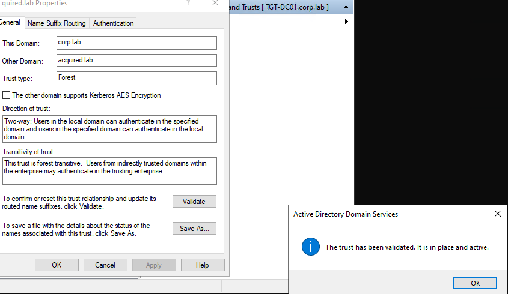<br><b>Forest trust validated and active</b></td>
<td width="50%">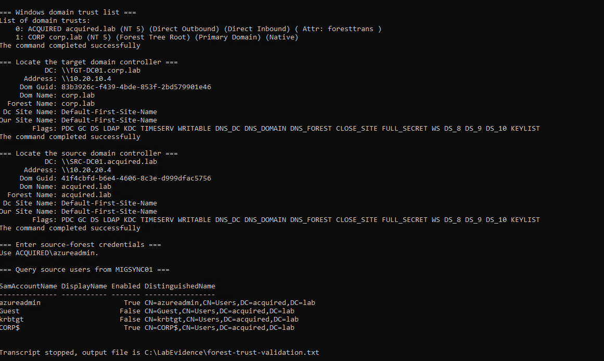<br><b>Cross-forest discovery from MIGSYNC01</b></td>
</tr>
</table>

### Migration and access

<table>
<tr>
<td width="50%">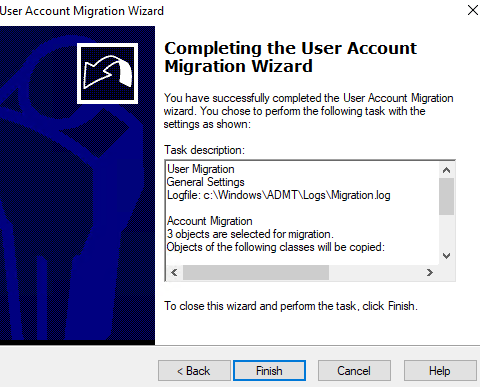<br><b>Three pilot users selected for migration</b></td>
<td width="50%">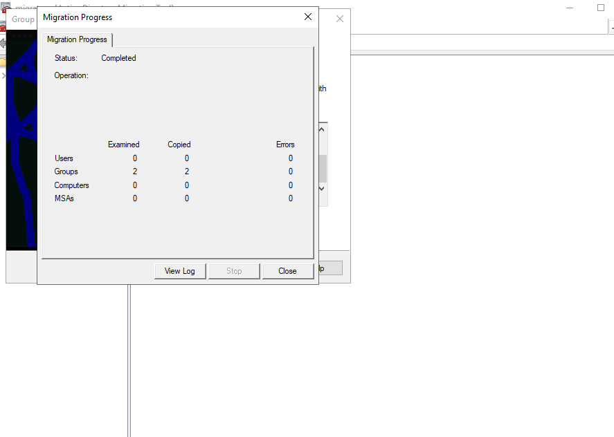<br><b>Two groups migrated with zero errors</b></td>
</tr>
<tr>
<td colspan="2">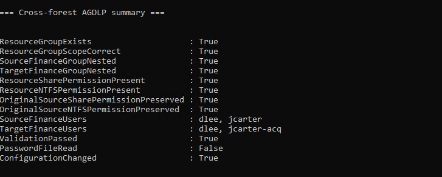<br><b>AGDLP-style resource authorization validated</b></td>
</tr>
</table>

### Hybrid identity

<table>
<tr>
<td width="50%">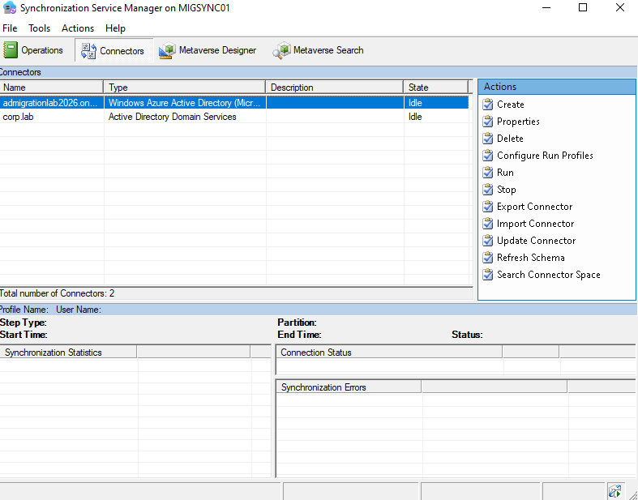<br><b>Exactly two Microsoft Entra Connect connectors</b></td>
<td width="50%">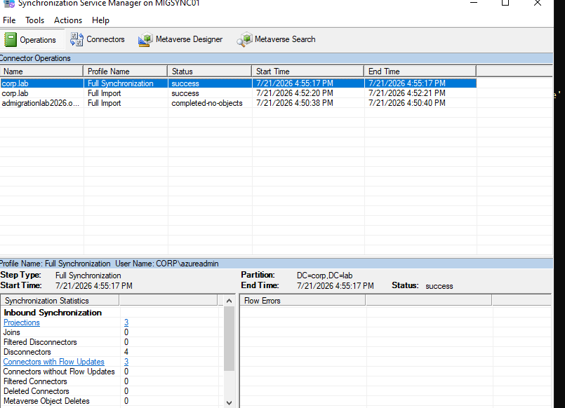<br><b>Target-forest full synchronization</b></td>
</tr>
<tr>
<td width="50%">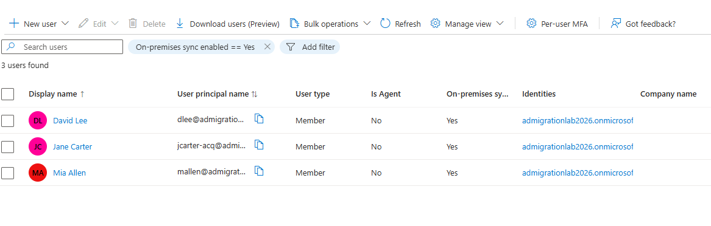<br><b>Exactly three on-premises synchronized users</b></td>
<td width="50%">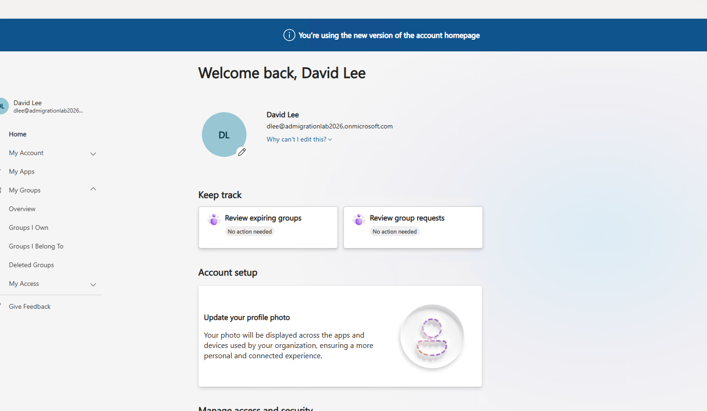<br><b>End-to-end cloud authentication validation</b></td>
</tr>
</table>

### Monitoring and cost

<table>
<tr>
<td width="50%">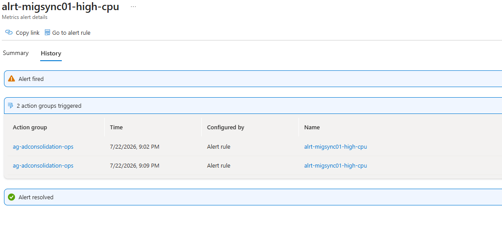<br><b>Alert fired and automatically resolved</b></td>
<td width="50%">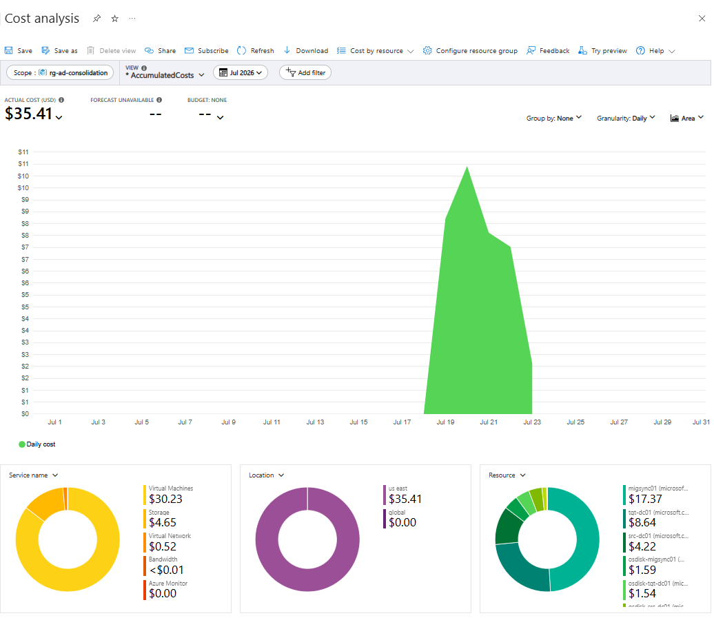<br><b>Resource-group cost review</b></td>
</tr>
</table>

<details>
<summary><b>Additional evidence screenshots</b></summary>

- Target and source Active Directory installation
- Source forest prerequisite validation
- Security-group auditing GPO
- Pre-ADMT snapshot validation
- Source resource-access baseline
- Target OU and migration landing-zone creation

See the [`screenshots`](screenshots/) directory and the [screenshot map](docs/screenshot-map.md).

</details>

## Troubleshooting examples

### Interrupted Terraform apply

I compared Azure with Terraform state before changing anything. The existing resource was imported, only the missing change was applied, and the final drift check passed.

### Management server NLA failure

Starting `MIGSYNC01` before `TGT-DC01` caused domain-dependent NLA authentication to fail. The correct recovery was to start the target domain controller first and restore the dependency, not disable NLA.

### Nested Azure Policy JSON

The first script displayed all three VMs but counted the nested result as one object. I preserved the failed output, corrected the array expansion, and reran the validation.

### Locked PowerShell transcript

The final evidence inventory initially failed because an older PowerShell process retained a transcript handle. I identified and closed the exact process, confirmed the file was unlocked, and reran the complete inventory.

### False-positive public-IP scan

A publication scan interpreted dotted software versions as possible IPv4 addresses. The refined context scan classified them as PowerShell or Azure AD Sync version metadata and found no confirmed public IP in the scanned text evidence.

## What I learned

The most important technical lesson was that identity synchronization depends on sequence.

`mS-DS-ConsistencyGuid` was not written before the first cloud export because the built-in rule required the cloud source anchor first. The cloud object had to be created and imported before the corresponding Active Directory update could be staged.

This reinforced a broader principle:

> Do not treat synchronization as a black box. Review imports, joins, attribute flows, pending exports, and scope before enabling automation.

## What I would change in a second version

- Create the change request, success criteria, stop conditions, and evidence manifest before implementation.
- Standardize evidence numbering from the first step.
- Build monitoring and budget controls earlier.
- Automate creation of the sanitized portfolio evidence set.
- Add workstation, user-profile, and application migration.
- Add Intune or another endpoint-management phase.
- Add backup and recovery validation.
- Use private administrative connectivity such as Azure Bastion or VPN.
- Add a second Microsoft Entra Connect server in staging mode.
- Use a verified routable custom domain in production.
- Integrate the change with an authoritative ITSM platform and real approval workflow.
- Expand the pilot by department, application, and access pattern.
- Plan formal source-domain decommissioning and post-migration support.

## Repository structure

```text
azure-ad-domain-consolidation/
├── README.md
├── .gitignore
├── .terraform.lock.hcl
├── main.tf
├── variables.tf
├── outputs.tf
├── versions.tf
├── terraform.tfvars.example
├── docs/
│   ├── architecture-overview.svg
│   ├── migration-flow.svg
│   ├── operations-and-evidence.svg
│   ├── screenshot-map.md
│   └── push-to-github.md
├── screenshots/
│   └── selected sanitized portfolio evidence
├── scripts/
│   └── publication and closeout helpers
└── evidence/
    └── curated evidence only
```

## Reproduction notes

This repository is intended to document the design and automation pattern, not to publish live credentials or full private evidence.

Before deployment:

1. Review Azure quota and VM SKU availability.
2. Create a private `terraform.tfvars`.
3. Restrict management access to a trusted source.
4. Validate the Windows Server image and disk-controller capabilities.
5. Run `terraform init`, `terraform validate`, and `terraform plan`.
6. Deploy the infrastructure.
7. Follow the documented dependency order for DNS, domain controllers, trust, migration, and synchronization.

## Security and publication boundaries

The repository must not contain:

- Passwords or MFA codes
- Real `terraform.tfvars`
- Terraform state
- PES keys
- Private certificates
- RDP files
- Installer binaries
- Authentication tokens
- Full private evidence archives

Subscription IDs are identifiers rather than passwords, but public copies should still avoid unnecessary tenant and subscription metadata where practical.

## Cleanup status

The Azure environment was removed after technical validation, evidence collection, and the Part 5 Loom recording were complete.

Final cleanup included:

- Disabled and preserved the three 11:00 PM auto-shutdown schedules before teardown.
- Used `terraform destroy` to remove Terraform-managed infrastructure.
- Preserved Terraform's resource-group deletion protection.
- Identified and manually removed four resources created outside Terraform:
  - Two pre-ADMT managed-disk snapshots
  - One Azure Monitor metric alert
  - One Azure Monitor action group
- Reran `terraform destroy`.
- Deleted `rg-ad-consolidation`.
- Preserved the local project, Terraform configuration, README, screenshots, and private evidence.
- Deleted no Azure subscription or unrelated resource group.

Final Terraform result:

```text
Destroy complete! Resources: 1 destroyed.

## Portfolio summary

> Built and validated an enterprise-pattern cross-forest Active Directory consolidation pilot in Azure. Deployed the infrastructure with Terraform, configured separate source and target forests, conditional DNS forwarding, a two-way trust, discovery and conflict mapping, ADMT/PES user and group migration, password continuity, AGDLP-style access transition, target-domain Group Policy, and target-forest synchronization to Microsoft Entra ID. Added Azure Monitor, Azure Policy, Cost Management, change documentation, and SHA-256 evidence validation.


